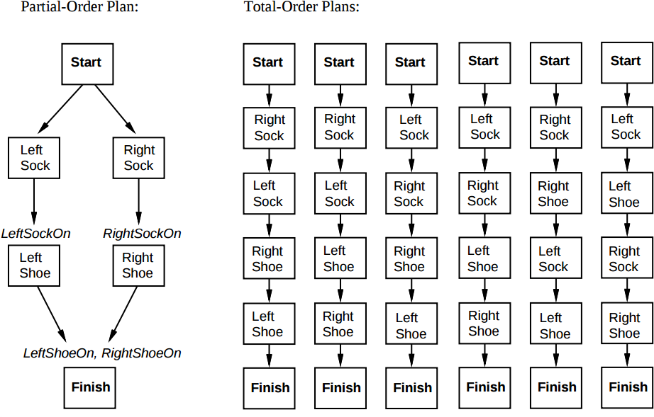
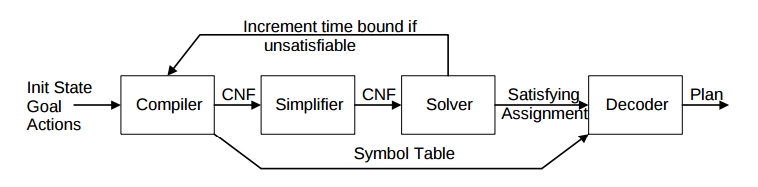

# Research Review
## Historical Developments in AI Planning
March 19, 2017  
Terence So

### [Partial Order Planning](https://en.wikipedia.org/wiki/Partial-order_planning)

The earliest AI planners dealt with constructing totally ordered plans. Generated plans consisted of a strictly linear sequence of actions. Also called Linear Planning, these planners found to be incomplete, made apparent with the discovery of the [Sussman Anomaly](https://en.wikipedia.org/wiki/Sussman_Anomaly) in 1975. In contrast, partially ordered sequence and the planning algorithms practice "Least Commitment", allowing them to decompose problems with independent subgoals.

[
A partial and total plans for putting on shoes and
 socks
](http://aima.cs.berkeley.edu/2nd-ed/newchap11.pdf)

The construction of partially ordered plans (then called task networks) was pioneered by the NOAH planner and the NONLIN system in 1975. Partial order planning came to [dominate]((http://aima.cs.berkeley.edu/2nd-ed/newchap11.pdf)) the next 20 years of research.

### [Planning as Satisfiability](https://en.wikipedia.org/wiki/Satplan)
First proposed by Henry Kautz and Bart Selman in 1992, SATPlan uses linear-size encodings for the main classes of plans (similar to GraphPlan). Unlike explicit state-space search, they can be implemented with a memory consumption that is linear in the length of a plan or transition sequence. Moreover, the latest planners based on SAT are said to [exceed](https://users.ics.aalto.fi/rintanen/satplan.html) the performance of planners based on other search paradigms (e.g. Explicit State-Space, Binary Decision Diagrams).

[
Typical SATPlan Architecture
](http://homes.cs.washington.edu/~weld/papers/pi2.pdf)

SATPlan's space efficiency is achieved through _Action Splitting_ and the use of  _Frame Axioms_ to constrain fluents when an action occurs. The core of the SATPlan solver is the [Davis–Putnam–Logemann–Loveland (PDDL) Algorithm](https://en.wikipedia.org/wiki/DPLL_algorithm) - a complete, backtracking-based search algorithm for deciding the satisfiability of propositional logic formulae in conjunctive normal form.

### [Temporal Planning](https://users.ics.aalto.fi/rintanen/temporalplanning.html)

Classical planning makes some basic assumptions that actions and events have no duration and state transitions are instantaneous. However, in applications such as robotics, multiple actions can be taken simultaneously, their durations may vary, and actions and events may have complex interdependencies which determine which combinations are possible.
Therefore, it has become necessary to model the duration and concurrency of actions and events. This is in the area of temporal planning.

Modeling in temporal planning includes state variables as in classical planning, but in addition, actions have time intervals and resources. Resources are used by actions and can be constrained in different ways:

1. unary resources: may be used by at most one action at a time.
2. n-ary resources: may be used by at most n action at a time.
3. state resources: have multiple states and the resource could not be used in different states at the same time.

Recent efforts to tackle temporal planning have resulted in extensions to SAT. These include the addition of numeric state variables (LPSAT, Wolfman and Weld, 1999) and continuous time models with continuous change (Shin and Davis, 2005). This has evolved into what is now known as [Satisfiability Modulo Theories (SMT)](https://users.ics.aalto.fi/rintanen/PlanningBySMT.html), which extends the language of propositional logic with non-Boolean theories such as linear real arithmetics.
